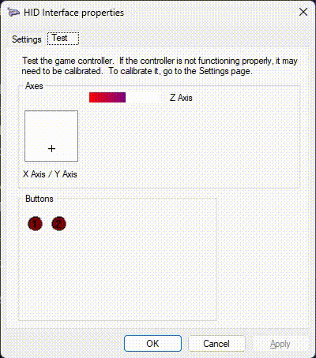

# USB HID gadget function on UNO Q



Adds two HID functions to the board's existing ADB USB gadget (`g1`), exposed
as one compound device: a boot-protocol keyboard (`hid.usb0`) and a 3-axis /
2-button game controller (`hid.usb1`).

## 1. Why a kernel module was needed

The gadget's identity is assembled entirely at runtime via configfs by
`/usr/lib/android-sdk/platform-tools/adbd-usb-gadget`, invoked by
`adbd.service` (`ExecStartPre=... setup`, `ExecStartPost=... activate`,
`ExecStopPost=... reset`). That script only creates `ffs.adb` (adb) and
`acm.GS0` (serial) under `functions/`.

Adding HID means creating `functions/hid.usb0` (and, for the joystick,
`functions/hid.usb1`), which both need `usb_f_hid.ko` — one module backs
every `hid.usb*` function. It doesn't exist on this system:

```
$ grep CONFIG_USB_CONFIGFS_F_HID /boot/config-$(uname -r)
# CONFIG_USB_CONFIGFS_F_HID is not set
$ find /lib/modules/$(uname -r) -iname 'usb_f_hid*'
(nothing)
```

So step one was building it out-of-tree for the exact running kernel
(`7.0.0-g122c2c22d838`).

## 2. Files in this directory

| File | What it is |
|---|---|
| `module/f_hid.c`, `module/u_hid.h` | Upstream kernel source, copied **verbatim** (see §3) |
| `module/Makefile` | Minimal Kbuild file for building just this one function out-of-tree |
| `module/usb_f_hid.ko` | Built module — `vermagic` matches `uname -r` exactly |
| `arduino-hid-gadget` | Boot-time setup/teardown script for both HID functions, hooks into `adbd.service`; also doubles as a live-test tool (`add`, `test`, `sendstring`, §5) |
| `10-hid.conf` | systemd drop-in wiring the above into `adbd.service` |
| `99-hidg.rules` | udev rule: any `/dev/hidg*` owned by group `dialout` (no root needed to write reports) |
| `test-hid-live.sh` | Standalone prototype used to first validate `hid.usb0` (keyboard only) before the joystick function and the live-test commands were folded into `arduino-hid-gadget` itself |

## 3. Building `usb_f_hid.ko`

### 3.1 Get matching kernel headers

Arduino's own apt repo carries headers that exactly match the running
kernel:

```bash
mkdir -p /tmp/hidwork && cd /tmp/hidwork
apt-get download linux-headers-7.0.0-g122c2c22d838
mkdir -p headers-extracted
dpkg-deb -x linux-headers-7.0.0-g122c2c22d838_*.deb headers-extracted/
```

This ships `Module.symvers`, `include/generated/autoconf.h`, and
`include/config/auto.conf` already populated — i.e. a fully prepared build
tree, no `make modules_prepare` needed. It does **not** ship `drivers/`
source, only `include/`.

### 3.2 Get `f_hid.c` / `u_hid.h`

There's no exact-source-match package for this vendor kernel (no `deb-src`
line configured, `apt-get source` fails). Use Debian's `linux-source-7.0`
package instead — the gadget function API surface (`struct
usb_function_instance`, `linux/usb/composite.h`, `linux/usb/func_utils.h`,
...) is stable across point releases, and those headers match the ones in
the Arduino headers package:

```bash
cd /tmp/hidwork
apt-get download linux-source-7.0
mkdir -p extracted && dpkg-deb -x linux-source-7.0_*.deb extracted/

mkdir -p src
tar -xf extracted/usr/src/linux-source-7.0.tar.xz -C src \
  "linux-source-7.0/drivers/usb/gadget/function/f_hid.c" \
  "linux-source-7.0/drivers/usb/gadget/function/u_hid.h"

cp src/linux-source-7.0/drivers/usb/gadget/function/f_hid.c  /home/arduino/hid-gadget/module/
cp src/linux-source-7.0/drivers/usb/gadget/function/u_hid.h  /home/arduino/hid-gadget/module/
```

### 3.3 Build

```bash
cd /home/arduino/hid-gadget/module
make KDIR=/tmp/hidwork/headers-extracted/usr/src/linux-headers-7.0.0-g122c2c22d838
```

## 4. Installing the module

```bash
sudo mkdir -p /lib/modules/$(uname -r)/extra
sudo cp /home/arduino/hid-gadget/module/usb_f_hid.ko /lib/modules/$(uname -r)/extra/
sudo depmod -a
sudo modprobe usb_f_hid && echo OK
```

## 5. Live-testing before persisting

**Run this over Wi-Fi SSH or the serial console — not over adb.** The
gadget's UDC gets unbound and rebound, which drops any SSH session tunneled
through it.

On the host, confirm a 4th interface, HID class:

```bash
lsusb -v -d 2341:0078 | grep -E 'bNumInterfaces|bInterfaceClass|iInterface'
# bNumInterfaces: 0x04, one bInterfaceClass: 0x03 (HID)
```

### 5.2 Both functions via `arduino-hid-gadget` itself

`arduino-hid-gadget` grew its own live-test commands so the compound device
(keyboard + joystick) can be exercised without a separate script. `add` does
the same unbind/create-both-functions/link/rebind dance as
`test-hid-live.sh add`, but for `hid.usb0` **and** `hid.usb1`:

```bash
sudo /home/arduino/hid-gadget/arduino-hid-gadget add
```

Confirm a 5th interface (2 HID classes: keyboard + joystick) on the host,
then a text field focused, run:

```bash
sudo /home/arduino/hid-gadget/arduino-hid-gadget sendstring "hello 123"
```

...which types the string one character at a time (a-z, A-Z with Shift, 0-9,
space, `.`, `,` are mapped to real keycodes; anything else is skipped with a
warning on stderr, not a hard failure). And with any joystick-aware
input-testing page/app in focus (or `evtest`/`jstest` on Linux):

```bash
sudo /home/arduino/hid-gadget/arduino-hid-gadget test
```

...which sweeps X, Y, then Z to +127, then -127, then back to neutral, and
presses/releases Button 1 then Button 2. Revert with the existing `teardown`
command (or reboot, since nothing is persistent yet):

```bash
sudo /home/arduino/hid-gadget/arduino-hid-gadget teardown
```

## 6. Making it persistent across boots

Not yet done. This installs `arduino-hid-gadget` as a drop-in for
`adbd.service`, so HID gets added every time the gadget is (re)built at
boot.

```bash
sudo cp /home/arduino/hid-gadget/arduino-hid-gadget /usr/local/sbin/arduino-hid-gadget
sudo chmod +x /usr/local/sbin/arduino-hid-gadget

sudo mkdir -p /etc/systemd/system/adbd.service.d
sudo cp /home/arduino/hid-gadget/10-hid.conf /etc/systemd/system/adbd.service.d/10-hid.conf

sudo cp /home/arduino/hid-gadget/99-hidg.rules /etc/udev/rules.d/99-hidg.rules
sudo udevadm control --reload-rules

sudo systemctl daemon-reload
sudo systemctl restart adbd.service   # drops adb, full gadget rebuild — expect it
```

Then re-run the host-side checks from §5, and confirm both `/dev/hidg0`
(keyboard) and `/dev/hidg1` (joystick) exist, owned by group `dialout`:

```bash
ls -l /dev/hidg0 /dev/hidg1
```

Also worth a full `reboot` afterward, once, to confirm the drop-in survives
a cold boot and not just a service restart.

## 7. Report descriptors

`arduino-hid-gadget` and `test-hid-live.sh` build the 63-byte boot keyboard
report descriptor from `HID_REPORT_DESC_TABLE` — one HID item per line as
`HEX  # mnemonic`, per HID 1.11 Appendix B.1 / USB HID Usage Tables, rather
than an opaque hex blob:

```
05 01   # Usage Page (Generic Desktop)
09 06   # Usage (Keyboard)
a1 01   # Collection (Application)
...
c0      # End Collection
```

`arduino-hid-gadget` builds the joystick's 45-byte descriptor the same way,
from `HID2_REPORT_DESC_TABLE`: a Generic Desktop Joystick collection with 3
signed 8-bit axes (X/Y/Z, range -127..127) followed by 2 buttons padded out
to a full byte. Its interrupt-IN report is 4 bytes: `[X, Y, Z, buttons]`,
where `buttons` bit 0 is Button 1 and bit 1 is Button 2.

`hid_report_desc()` strips the comments, converts each hex byte to an octal
escape, and emits the whole thing via a single `printf '%b'` — one
`write(2)` call. That matters: `report_desc_length` isn't a separate
attribute to set — the kernel derives it from the byte count of that one
write (`f_hid_opts_report_desc_store` in `f_hid.c`), so a descriptor written
in multiple pieces would silently record the wrong length. `hex_bytes()` is
the same trick applied to a short, fixed list of hex bytes instead of a
table — it's what `test`/`sendstring` use to write individual interrupt-IN
reports (`/dev/hidg*`) rather than a `report_desc`.

To change device type (e.g. the keyboard to a mouse) or add media keys, edit
the relevant table and its `HID*_PROTOCOL`/`HID*_SUBCLASS`/`HID*_REPORT_LENGTH`
trio in `arduino-hid-gadget`, or override them without editing the file via
`/etc/default/arduino-hid-gadget`.

## 8. Gotchas hit along the way

- **`/bin/sh` here is dash.** Its `printf` implements POSIX `\NNN` octal
  escapes only — `\xNN` hex escapes are emitted as literal characters, not
  bytes. A first version of the descriptor using `\x` came out as 252 bytes
  instead of 63.
- **configfs symlinks are resolved by the kernel at creation time**, not by
  the VFS the way ordinary symlinks are — `ln -s SOURCE DEST` needs a
  `SOURCE` that resolves from the calling process's cwd. An absolute-path
  `ln -sf $G/functions/X $G/configs/c.1/X` failed with `ENOENT`. Fixed by
  matching `adbd-usb-gadget`'s own pattern exactly: `cd` into the gadget
  root, relative symname, destination is the config directory.
- **Unbinding the UDC has an async tail.** Immediately after
  `echo "" > .../UDC`, both a subsequent `ln` into `configs/c.1` and a
  subsequent rebind write can transiently fail (`ENOENT` / `EBUSY`) even
  though the operation succeeds moments later. Both scripts retry (link
  creation, and rebind) instead of trusting a single attempt or a fixed
  sleep — rebind specifically polls `/sys/class/udc/*/state` for
  `configured` rather than trusting the write's exit status, which can
  report failure on a bind that actually completes.
- **`/dev/hidg0`/`/dev/hidg1` aren't addressable by function name.** The
  kernel numbers `hidg*` character devices in UDC-bind order, and configfs
  doesn't expose a function-name-to-minor mapping. `HID_DEV_KEYBOARD` and
  `HID_DEV_JOYSTICK` in `arduino-hid-gadget` are hardcoded on the assumption
  that `setup()` always creates the keyboard function before the joystick —
  if that call order ever changes, those two variables need to change with
  it.
- **The two HID interfaces can't be told apart by name — not without a
  kernel patch.** Both `hid.usb0` and `hid.usb1` show up on the host as
  "HID Interface"; that string is hardcoded in `ct_func_string_defs` in
  `module/f_hid.c`, and `struct f_hid_opts` (`module/u_hid.h`) has no field
  for configfs to set a per-function name from. There's also no way to fake
  it at the composite-gadget level: `iManufacturer`/`iProduct` under
  `${CONFIGFS_DIR}/strings/0x409/` are device-wide (shared by adb, acm, and
  both HID functions), not per-interface, so they can't say "keyboard" on
  one and "joystick" on the other either. Giving each function its own
  string (e.g. "Arduino HID Keyboard" / "Arduino 3 axis joystick") would
  mean patching `f_hid.c`/`u_hid.h` to add a writable interface-name
  attribute and rebuilding `usb_f_hid.ko` — deliberately not done here, to
  keep `f_hid.c`/`u_hid.h` as unmodified upstream copies (§3.2).
